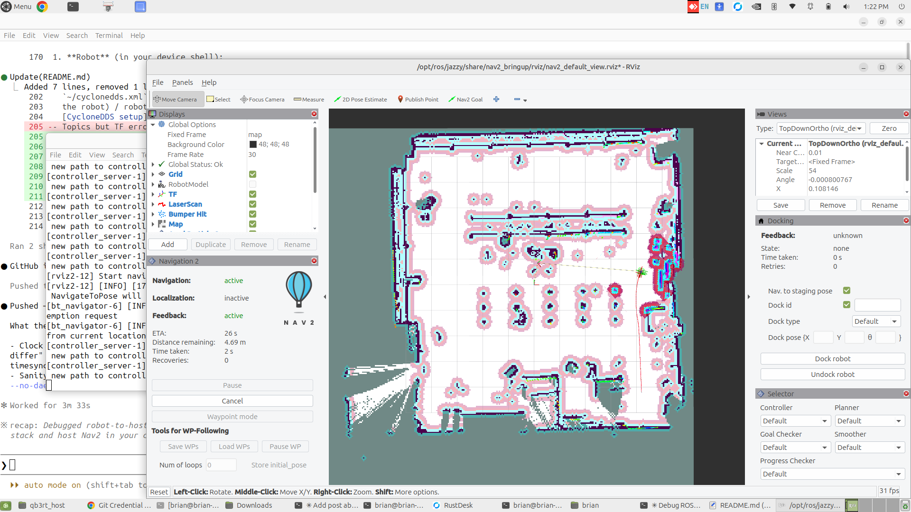

# QB3rt — teaching AGV on Qualcomm RB3 Gen 2

**QB3rt** is a classroom / lab AGV stack for a fleet of skid-steer rovers. Each unit is a [WAVE ROVER](https://www.waveshare.com/) base with a **Qualcomm Robotics RB3 Gen 2** (QIRP) as the onboard computer. Students and instructors use it to explore ROS 2 perception, localization, mapping, and Nav2 navigation on real hardware.

This repository is the project source: launch files, configs, calibration, deploy tooling, and docs.

> **⚠️ Migrated to Ubuntu 24.04.** The fleet has moved off the Qualcomm Linux / QIRP
> Yocto image onto the **Canonical Ubuntu 24.04** image. Provisioning is now a
> golden-image + SSH flow — see **[`docs/UBUNTU_MIGRATION.md`](docs/UBUNTU_MIGRATION.md)**.
> The `reference/`, `stamp/`, `handoff/`, `deploy/`, and `capture/` directories
> replace the old adb/overlay tooling (archived under `legacy_qirp/`). Base ROS is
> now apt `ros-jazzy-*` + the QIRP PPAs (`qrb_ros_camera`/`qrb_ros_imu`); custom
> packages build on-device into `/opt/qb3rt/install`. The notes below that still
> reference `/root/QB3rt`, `qirp-setup.sh`, or adb describe the old image.




**Repo:** [briandeegan82/QB3rt_rb3](https://github.com/briandeegan82/QB3rt_rb3)

---

## What it does

| Layer | Role |
|-------|------|
| **Drive** | WAVE ROVER motors via a calibrated HTTP bridge (`/cmd_vel` → wheel commands) |
| **VIO** | ORB-SLAM3 mono-inertial on the OV9282 tracking camera + RB3 IMU |
| **Odometry** | `robot_localization` EKF fuses VIO deltas, IMU yaw rate, and wheel `vx` |
| **2D SLAM** | RPLIDAR C1 + `slam_toolbox` builds `/map` and owns `map→odom` |
| **Nav** | Nav2 (planner / controller / BT) — onboard **or** remote on a laptop |

Typical teaching split: the robot runs sensing + SLAM; the laptop runs Nav2 +
RViz so students can watch the map and send goals over Wi‑Fi.

---

## Hardware (per robot)

- WAVE ROVER skid-steer chassis (open-loop drive; cannot pivot in place)
- Qualcomm RB3 Gen 2 running QIRP / ROS 2 (Jazzy-class stack)
- OV9282 tracking camera + onboard IMU → ORB-SLAM3 VIO
- RPLIDAR C1 on USB (`/dev/rplidar`)
- Chassis serial bridge on USB (`/dev/wave_rover`)

USB device nodes come from udev rules (`system/99-agv-serial.rules`) keyed by
each unit’s CP2102N chip serials in `units/<id>.conf`.

---

## Software layout

| Path | Role |
|------|------|
| `/root/QB3rt` | **Canonical project on the robot.** Edit here. Survives ostree reflashes (`/root` → `/var/roothome`). |
| `/usr/share/QB3rt` | Install / runtime copy. Nodes load from here. **Do not edit by hand** — run `deploy.sh`. |
| `vendor_overrides/` | Patches for vendor packages that have no editable source on-device (wave_rover bridge + calibration). |
| `laptop/` | Remote-Nav2 bundle for the instructor/student laptop. |
| `units/` | Per-robot profiles (ADB serial, `ROS_DOMAIN_ID`, USB serials, Wi‑Fi keep-list). |
| `overlay/` | Local cache of custom ROS binaries for bootstrap (**not** in git). |
| GitHub | Off-robot backup / class distribution of this tree. |

`/usr` is an **ostree read-only** mount. Before writing under `/usr` (or before
interactive `ros2` work), always:

```bash
source /root/rover_env.sh
```

That remounts `/usr` rw and sets up ROS / DDS. Laptop one-click deploy does this for you over adb; a shell on the device must still source it yourself.

---

## Quick start

### A. Fresh robot or class handoff (from a laptop)

Needs: USB adb to the RB3, this git clone, and the bootstrap overlay (downloaded once — see [SETUP.md](SETUP.md)).

```bash
cd /path/to/QB3rt
./fetch_overlay.sh                              # once: slim share/lib from GitHub Release
./deploy_via_adb.sh --unit 46927088 --clean --bootstrap
```

- `--clean` — wipe student Wi‑Fi passwords (except `WIFI_KEEP`) and clear
  `/root` project state for the next class
- `--bootstrap` — restore custom packages (ORB-SLAM, slam_toolbox, wave_rover, …)
  into `/usr` after a reflash or wipe
- Omit both for a routine project update: `./deploy_via_adb.sh --unit 46927088`

Full details: **[SETUP.md](SETUP.md)**.

### B. Edit on a robot that already has QB3rt

```bash
# on device (or via sshfs mount of /root/QB3rt)
source /root/rover_env.sh
# edit under /root/QB3rt …
bash /root/QB3rt/deploy.sh    # sync → /usr/share/QB3rt + vendor overrides
# then relaunch affected nodes
```

### C. Clone onto a blank `/root/QB3rt`

```bash
git clone https://github.com/briandeegan82/QB3rt_rb3.git /root/QB3rt
source /root/rover_env.sh
bash /root/QB3rt/deploy.sh
# still need overlay packages if the image was reflashed — use SETUP.md / --bootstrap
```

---

## Bring-up (on the robot)

**Before launching:** let the RB3 clock sync (or freeze NTP). The board has no working RTC; a mid-run clock step breaks the EKF. See
[laptop/README.md](laptop/README.md) and the note below.

### Recommended: two-step (you gate SLAM)

Start odometry, confirm VIO is healthy, *then* start lidar SLAM so a warming-up VIO never corrupts the map:

```bash
source /root/rover_env.sh

# 1) base + VIO + EKF (no SLAM, no Nav2)
ros2 launch QB3rt odometry_bringup.launch.py
#    • wait for /odometry/filtered
#    • drive a small figure-8 for ORB-SLAM3 init, then STAND STILL until
#      the relay logs "VIO metric convergence confirmed" (/vio/ready=true)
#    • parked: ros2 topic echo /odometry/filtered --field twist.twist  → ~0

# 2) RPLIDAR + slam_toolbox → map→odom
ros2 launch QB3rt slam_toolbox.launch.py

# 3) Nav2 on the laptop — follow laptop/README.md
```

### One-shot (automatic `/vio/ready` gate)

```bash
source /root/rover_env.sh

# full stack onboard (SLAM + Nav2 on the robot)
ros2 launch QB3rt full_stack.launch.py

# robot sensing + SLAM only; Nav2 remote on the laptop
ros2 launch QB3rt full_stack.launch.py enable_nav:=false
```

Other launches: `perception.launch.py` (camera/VIO), `lidar_slam.launch.py` (camera-free lidar SLAM), `odom_square_test.launch.py` (drive calibration — see [docs/odometry_calibration.md](docs/odometry_calibration.md)).

---

## Architecture (REP-105 frames)

```
map ──(slam_toolbox)──> odom ──(EKF)──> base_footprint ──(URDF)──> base_link
                                                              └─> wheels / laser / imu / cams
```

| Transform | Owner | Notes |
|-----------|--------|--------|
| `map→odom` | slam_toolbox | From `/scan` |
| `odom→base_footprint` | EKF only | Fuses VIO (differential), IMU yaw rate, wheel `vx` |
| `base_footprint→…` | URDF / static TF | Sensors and links |

**VIO trust gate** (`scripts/orbslam3_pose_to_odom.py`): lateral motion is VIO-only-observable. The relay feeds the EKF only after VIO is gravity-aligned *and* metrically converged (wheels ~0 and VIO ~0 for a few seconds). It also drops frames implying >0.6 m/s (above the ~0.42 m/s platform top speed). End the figure-8 init with a brief stop so the gate can latch.

**Bridge:** `publish_tf: false` on the wave_rover driver — otherwise two parents claim `base_link` and Nav2 breaks.

**Drive model:** open-loop calibrated feedforward (deadband, max speed, skid turn gain, left/right trim). Firmware `motor_cmd_max: 0.5`. The base cannot spin in place; Nav2 is configured for arc-only motion (no rotate-to-heading /Spin recovery). Details: [docs/odometry_calibration.md](docs/odometry_calibration.md).

---

## Laptop Nav2 + RViz

Install Nav2, copy the laptop bundle, and peer CycloneDDS with the robot — see **[laptop/README.md](laptop/README.md)**. Summary:

1. Robot: `full_stack.launch.py enable_nav:=false` (or the two-step above)
2. Laptop: Nav2 + RViz; `/cmd_vel` goes over Wi‑Fi to the bridge
3. Bridge `cmd_timeout: 0.5` stops the wheels if the link drops

---

## Operational gotchas

1. **Clock** — Sync (or disable NTP after sync) *before* launching. A boot-time timesync step while the EKF is running causes wild odometry drift.
2. **`source /root/rover_env.sh`** — Required for `/usr` writes and a correct ROS/DDS environment on device.
3. **`ROS_DOMAIN_ID`** — Unique per robot on the same Wi‑Fi (`units/*.conf`).
4. **VIO init** — Figure-8, then stand still until `/vio/ready` before trusting maps / Nav2.
5. **USB serials** — After swapping lids or lids/bases, update `units/<id>.conf` and udev rules so `/dev/rplidar` and `/dev/wave_rover`
   point at the right CP2102Ns.

---

## Documentation map

| Doc | Contents |
|-----|----------|
| [SETUP.md](SETUP.md) | One-click adb deploy, bootstrap overlay, class `--clean` |
| [laptop/README.md](laptop/README.md) | Remote Nav2, DDS, clock sync |
| [docs/slam_nav2.md](docs/slam_nav2.md) | Live SLAM + Nav2 (onboard vs laptop) |
| [docs/odometry_calibration.md](docs/odometry_calibration.md) | Wheel / bridge calibration |
| [docs/orbslam3_calibration.md](docs/orbslam3_calibration.md) | Camera / VIO calibration |
| [docs/system_audit_2026-07-16.md](docs/system_audit_2026-07-16.md) | Historical device audit (dated) |

---

## License

Apache-2.0 — see `package.xml`.